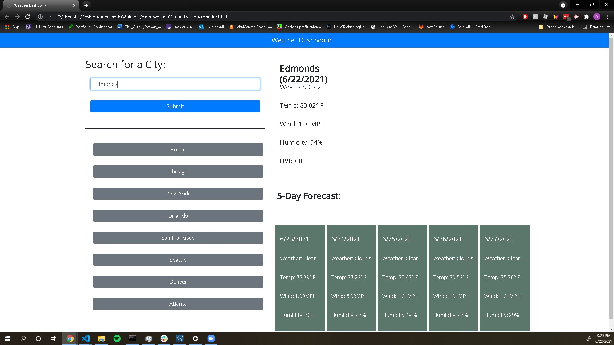

# WeatherDashboard

## App Description 
The purpose of this app is to serve as a weather application which allows the user to either click on one of the preset cities to view the current weather data and the
weather data for the previous 5 days, or the user can simply search a city and have the same information be filled in for the desired city.
For lack of simplicity and due to problems, the app simply writes out the current weather condition out instead of displaying a little graphic
based off of the current weather condition.

## Motivation Behind the project/why I built it
My motivation to create this project was to be able to view the current weather condition through this app and compare my results to other apps like the weather.com app

## Problems I came across during development
During the development I came over a lot of issues. My first issues came during the creating/ layout of the actual website. I had problems with making the website look similar to the example that was given to us which caused me to spend way more time than I should have on that portion. The next big issue I came upon was having the API calls actually work, this took me a bit of time to realize what I was doing wrong and it really came down to me simply not copying my entire key in. An issue which I'm saving to solve due to time restraints and will visit once I'm caught up on assignments is getting my png images to change based off the weather. When I originally tried troubleshooting it, I got the logic working to display the image based off the current weather, but for whatever reason the .innerhtml was not being changed properly, thus I gave that up for the time being and simply have it display the current weather condition in text format instead of image format.

## What I learned from this project
From this project, I was able to learn to better use bootstrap with creating website layouts, as well as doing some of my own CSS work. Besides that I learned to better use APIs and create calls from the APIs as well as display gathered data from the APIs

## App usage
To use this app, simply open the link at the bottom of this ReadMe and you'll be brought to the app. Upon visiting the app you will be able to either click one of the boxes on the left hand side to view the information for a preset city, or you'll be able to type in a different city to try it out. In the image below you'll see I typed in Edmonds to see the results.

## Link to the App
https://dannyroubin.github.io/Homework6-WeatherDashboard/
